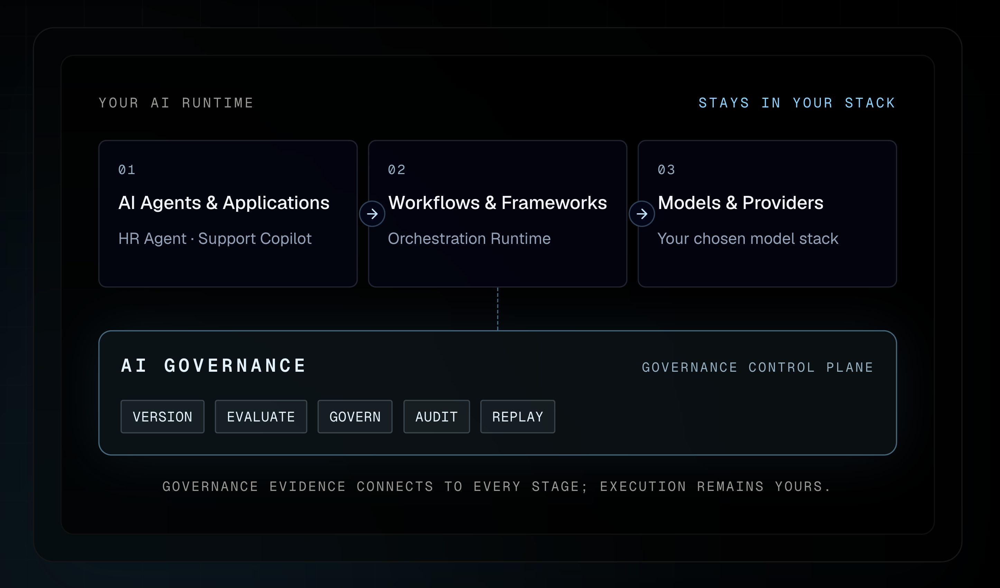
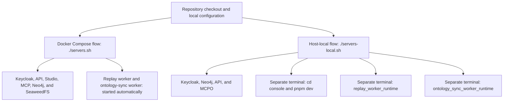

# BHANUJ

## AI Governance Control Plane

> **Know why an AI action happened, what changed, and whether it is safe to proceed.**

It is an open-source control plane around AI systems. It records versioned
assets and runtime evidence, evaluates behaviour, applies deterministic policy,
and preserves the decision and its lineage—without owning your AI runtime,
application, or deployment system.

```text
Your AI systems → assets + runtime evidence → evaluate → policy → decision + audit trail
```

### Understand BHANUJ - AI Governance Control Plane in 20 seconds

Use when your team needs reliable answers to questions such as:

- **Which prompt, model, or configuration behaves better?** Run an experiment
  and retain item-level evaluation evidence.
- **Why was this AI action approved, rejected, or blocked?** Inspect the
  policy, evidence, and deterministic decision path.
- **What changed and what does it affect?** Follow the lineage between assets,
  evaluations, and decisions; use replay to examine historical evidence.
- **Can we govern AI without replacing our stack?** Connect the runtime and
  keep applications, frameworks, model providers, and deployments under your
  ownership.

It is **not** model serving, an agent framework, a workflow orchestrator,
or a generic GRC system. It is the governance layer that makes AI activity
reviewable, explainable, and auditable.

**Modern AI frameworks help build agents. BHANUJ - AI Governance Control Plane governs the evidence and decisions around them.**

> **Enterprise capabilities are under active development. Commercial offerings
> will be announced as they mature.**



- [Website](https://ai-governance.bhanuj.app)
- [Documentation](https://ai-governance.bhanuj.app/docs)
- [Tutorials](https://ai-governance.bhanuj.app/tutorials)
- [Start with the governed replay walkthrough](docs/tutorials/governed-replay-walkthrough.md)
- [Understand the platform boundary](docs/architecture/ARCHITECTURE.md)
- [Roadmap](docs/roadmap/ROADMAP.md)

---

## See AI Governance Control Plane Studio

<table>
  <tr>
    <td width="50%"><br /><strong>Governance Decisions</strong> — inspect deterministic outcomes and their supporting evidence.</td>
    <td width="50%"><br /><strong>Decision Lineage</strong> — trace the assets, policies, and executions behind an outcome.</td>
  </tr>
  <tr>
    <td width="50%"><br /><strong>Evidence Graph</strong> — make the basis of a decision visible and auditable.</td>
    <td width="50%"><br /><strong>Knowledge Graph</strong> — explore governed AI assets and their relationships.</td>
  </tr>
</table>

## Why AI Governance Control Plane?

AI systems are no longer just about selecting the best model. Teams need to
answer governance questions such as:

- Why was this decision made?
- Which prompt, model, dataset, and policies produced this outcome?
- Can this decision be explained and replayed?
- What changed between two deployments?
- Can quality regressions automatically block promotion?
- Can governance remain independent of orchestration frameworks and model vendors?

AI Governance Control Plane provides the governance control plane that answers these questions.

---

## Core Concepts

Everything in AI Governance Control Plane revolves around five fundamental concepts.

### Governance Asset

A versioned, immutable resource such as a prompt, model, dataset, experiment, evaluation, workflow, or governance decision.

### Governance Ontology

A semantic graph describing relationships between governed assets.

### Evidence

Structured evidence collected from governed resources that supports a governance decision.

### Policy Engine

Deterministic governance rules evaluated against evidence.

### Governance Decision

An explainable, auditable outcome generated from evidence and policy.

---

## Platform Architecture


AI Governance Control Plane is organized into independent architectural planes.

- Authentication Plane
- Governance Ontology Plane
- Governance Decision Plane
- Registry Plane
- Experiment Plane
- Evaluation Plane
- Job Execution Control Plane
- Replay Plane
- Audit Plane
- Persistence Plane
- REST Control Plane
- MCP Server
- AI Governance Control Plane Studio

Each plane owns a single responsibility and communicates only through explicit contracts.

---

## Core Capabilities

### Semantic Governance

- Governance Ontology
- Governance Decision Engine
- Decision Graph
- Explainability
- Lineage
- Evidence Graphs

### AI Asset Governance

- Prompt Registry
- Model Registry
- Dataset Registry
- Immutable Versioning
- Lifecycle Management

### Quality Governance

- Evaluation Framework
- Experiment Management
- Candidate Comparison
- Drift Analysis
- Replay-aware Governance
- Leaderboards

### Execution Governance

- Execution Audit
- Workflow Replay
- Job Execution Control Plane
- Async Governance Jobs

### Platform Interfaces

- Versioned REST APIs
- MCP Server
- Next.js AI Governance Control Plane Studio

---

## Current Implementation

AI Governance Control Plane currently includes:

- Registry-centric Assets workspace for versioned prompts, models, datasets,
  and evaluation providers, with common overview, version, reference, lineage,
  and audit-history views
- Versioned prompt, model, and dataset registries; local dataset content stored
  through SeaweedFS's S3-compatible API and production-ready standard S3 support
- Vendor-neutral observed prompt/model evidence ingestion with persisted source
  provenance and optional protected prompt content hashes
- A guided `ai-governance walkthrough governed-replay` command that demonstrates the
  asset, evaluation, governance, replay, lineage, and audit lifecycle through
  the same public REST APIs used by Studio and external producers
- Generic in-memory OAuth client-credentials support for local workloads and
  CI, with no token persistence
- Experiment lifecycle management, candidates, evaluation runs, rankings, and leaderboards
- Tenant-owned Runtime Connections with native OpenAI and Anthropic execution,
  plus OpenAI-compatible custom endpoints
- Pluggable evaluation provider contracts with TruLens support
- Execution audit, workflow replay, evaluation history, comparison, and drift analysis
- Async governance job submission, status lookup, cancellation, retry, leases, and worker execution
- Governance ontology contracts, graph query APIs, ontology synchronization, and Neo4j-backed graph exploration
- Governance decision models, policy evaluation, evidence building, reasoning, persistence, audit records, and ontology projection
- Decision REST APIs and MCP tools for evaluation, retrieval, listing, evidence, explanation, and lineage
- AI Governance Control Plane Studio home dashboard, policy engine authoring, ontology graph exploration, decision index browsing, decision lookup, and visual decision detail inspection
- SQLite and PostgreSQL reference persistence, with optional Snowflake analytics persistence

---

# Run Locally

Start the local Studio, API, ontology, worker and storage topology:

```bash
# Clone Repository
git clone https://gitlab.com/bhanuj-ai/ai-governance-oss.git
cd ai-governance-oss

# Optional: installs host-development and test dependencies
uv sync

# Create the required development-only configuration files (do not commit them)
cp .env.platform.example .env.platform
cp keycloak-postgres/.env.keycloak.example keycloak-postgres/.env.keycloak
cp console/.env.local.example console/.env.studio

# Starts local Keycloak, builds the platform, and starts the Compose stack
./servers.sh

```

`./servers.sh` starts local Keycloak automatically, then starts the containerized
local stack. You do not need to run the Keycloak launcher separately. The three
files above configure the platform, Keycloak and Studio respectively. Their
example values are development-only; change them on shared machines and never
use them in production. The launcher generates `.env.build` and the local
service-account files itself.

### Local Runtime Process



Choose one runtime flow. `./servers.sh` runs the complete containerized
topology, including both workers. `./servers-local.sh` is for host API/MCP
development and deliberately leaves Studio and both workers as separate host
processes.

Use the same wrapper to inspect or manage the stack:

```bash
./servers.sh logs                    # Follow all application and infrastructure logs
./servers.sh logs ai-governance-platform    # Follow only API logs
./servers.sh ps                      # Show service status
./servers.sh down                    # Stop services and preserve local data
```

Keycloak runs in its own Compose project, so follow its logs separately when
investigating sign-in or service-account startup:

```bash
(cd keycloak-postgres && docker compose --env-file .env.keycloak logs --follow keycloak)
```

For host-local API or MCP development rather than Docker Compose, also create
`.env.local` from its template. Uvicorn does not automatically load either
environment file:

```bash
cp .env.local.example .env.local
```

## Local preflight before committing

Run the local quality gate before creating a commit. It prompts for a
[Conventional Commit](https://www.conventionalcommits.org/en/v1.0.0/) message
and release-note bullets, checks the patch, runs Python lint and unit tests,
and type-checks Studio when `console/` changed. It does not commit, push, or
start Docker services.

```bash
./scripts/dev/preflight.sh
```

It is also scriptable for CI-like local use:

```bash
./scripts/dev/preflight.sh \
  --message "fix(jobs): retain local demo records" \
  --summary "Keep local demo jobs visible within the retention window"
```

## Your first two minutes in Studio

Open [AI Governance Control Plane Studio](http://localhost:3000) after `./servers.sh` completes. It
will redirect you to the local Keycloak sign-in page. Sign in as `studio` with
the `AI_GOVERNANCE_STUDIO_PASSWORD` value from `keycloak-postgres/.env.keycloak`.
The local stack starts with representative demo data, so you can follow the
full governance flow immediately:

1. Open **Assets** to explore versioned prompts, models, datasets, and their history.
2. Open **Experiments**, choose a seeded draft experiment, inspect the displayed run plan, and select **Start Experiment** to run a governed evaluation. The confirmation shows the candidate × dataset-item model invocation count; use **Cancel Experiment** to stop further calls while retaining captured evidence.
3. Inspect the resulting **Governance Decision** and its policy outcome, explanation, and evidence.
4. Open **Ontology** to view the lineage and knowledge graph behind the decision.
5. Open **Replay** to inspect a seeded replay or create and submit a replay from an execution.

- Keycloak IDP on http://localhost:18080 (OSS local stack)
- REST API on http://localhost:8000
- AI Governance Control Plane Studio on http://localhost:3000
- Neo4j on bolt://localhost:7687
- AI Governance Control Plane MCP Stdio (MCPO) on http://localhost:8001/docs
- AI Governance Control Plane MCP Streamable HTTP Server on http://localhost:8002/
- SeaweedFS S3 API on http://localhost:8333 (local dataset content)
- SeaweedFS Filer UI on http://localhost:8888 (browse local dataset objects)
- SeaweedFS Master UI on http://localhost:9333 (storage topology)

See [Configuration](docs/reference/CONFIGURATION.md) for environment variables
used by the API, Studio, graph adapters, demo seeding, and MCP integrations.

Interactive API docs are available at:

```text
http://localhost:8000/docs
http://localhost:8000/redoc
http://localhost:8000/openapi.json
```

Local development starts with demo ontology data, a release-gate policy,
governance decisions, varied governance jobs, and representative MCP audit
records. SQLite-capable repositories share a database stored in the named
`ai-governance_sqlite_data` Docker volume, so seeded and locally created records
survive container recreation and normal `docker compose down` operations.

To stop the stack without deleting local data:

```bash
./servers.sh down
```

To delete the local SQLite, Neo4j, and SeaweedFS data and start with a clean
seed:

```bash
docker compose down -v
./servers.sh
```

To reseed the local demo data manually without deleting local state, use the
same short-lived Keycloak client-credentials flow as the local walkthrough and
MCP tools. `./servers.sh` generates `.env.oauth.generated` for the provisioned
local walkthrough service account; the token stays in the shell only and is not
printed or written to a file:

```bash
set -a
. ./.env.oauth.generated
set +a

AI_GOVERNANCE_DEMO_TOKEN="$(uv run python -c '
from ai_governance.oauth import access_token_from_environment
token = access_token_from_environment()
assert token, "AI_GOVERNANCE_OAUTH_* credentials are required"
print(token)
')"

curl --fail-with-body -X POST http://localhost:8000/api/v1/ontology/demo/seed \
  -H "Authorization: Bearer ${AI_GOVERNANCE_DEMO_TOKEN}"
unset AI_GOVERNANCE_DEMO_TOKEN
```

Set `AI_GOVERNANCE_AUTO_SEED_DEMO_DATA=false` to disable startup demo seeding.
The demo seed uses stable identifiers, so normal restarts refresh the demo
records rather than accumulating duplicates.

The Docker stack stores the seeded evaluation dataset in SeaweedFS through the
standard S3 API; its registry record points to an `s3://` URI. The non-Docker
local workflow uses the checked-in filesystem configuration and records a
root-confined `file://` URI under `.ai-governance/datasets`. Production uses
AWS S3: set `AI_GOVERNANCE_DATASET_OBJECT_STORE_BACKEND=s3`,
`AI_GOVERNANCE_DATASET_S3_BUCKET`, and AWS credentials/region. Leave
`AI_GOVERNANCE_DATASET_S3_ENDPOINT_URL` unset for AWS S3; set it only for an
S3-compatible endpoint such as SeaweedFS.

The Dataset Registry also supports direct CSV and JSONL upload from Studio.
AI Governance Control Plane validates and writes immutable dataset bytes to the configured object
store, then registers a DRAFT version with its immutable URI and SHA-256 checksum.

For a guided first run through Assets, SeaweedFS dataset storage, ontology
lineage, experiments, and governance decisions, see the
[end-to-end local tutorial](docs/tutorials/end-to-end-local.md).
For integrating a runtime or evaluator with the observed prompt/model catalog,
see the [producer integration guide](docs/tutorials/producer-integration.md).
For a reproducible terminal walkthrough of the full governed replay lifecycle,
see the [governed replay walkthrough](docs/tutorials/governed-replay-walkthrough.md).
The walkthrough includes a public-API-only release smoke script, restart
checkpoints, and safe local manifest cleanup.

Then open Studio and inspect the home dashboard, policy engine, jobs page,
graph explorer, or governance decision index.

---

# Reference Docs

- [Architecture](docs/architecture/ARCHITECTURE.md)
- [Plugin Extensions in Plain English](docs/architecture/PLUGIN_EXTENSION_GUIDE.md)
- [Plugin Runtime Processes](docs/architecture/PLUGIN_RUNTIME_PROCESSES.md)
- [Plugin Extension Contracts](docs/plugin-extension-contracts.md)
- [Configuration](docs/reference/CONFIGURATION.md)
- [Local Keycloak Authentication Setup](keycloak-postgres/Keycloak%20Authentication%20Setup.md)
- [Public API](docs/reference/PUBLIC_API.md)
- [REST API](docs/reference/REST_API.md)
- [MCP Server](docs/reference/MCP_SERVER.md)
- [MCP Usage and MCPO](docs/reference/MCP_USAGE.md)
- [Ontology Foundation](docs/ontology/ontology-foundation.md)
- [Neo4j Operations Guide](docs/ontology/neo4j-operations-guide.md)
- [Dependency Management](docs/maintenance/DEPENDENCY_MANAGEMENT.md)
- [Graph Query APIs](docs/ontology/graph-query-apis.md)
- [AI Governance Control Plane Studio](docs/ontology/governance-graph-console.md)
- [End-to-End Local Tutorial](docs/tutorials/end-to-end-local.md)
- [Producer Integration Guide](docs/tutorials/producer-integration.md)
- [Governed Replay Walkthrough](docs/tutorials/governed-replay-walkthrough.md)
- [Roadmap](docs/roadmap/ROADMAP.md)
- [Ontology Synchronization](docs/ontology/ontology-synchronization.md)

Brand assets and favicon sources live in [`assets/`](assets/).

---

# Design Principles

- Governance First
- Semantic by Default
- Explicit Data Contracts
- Version Everything
- Replayability
- Storage Independence
- Provider Independence
- Failure Isolation
- Observability by Default
- Control Plane Ownership

---

# Vision

AI Governance Control Plane provides the semantic governance layer for AI systems.

By combining ontology, governance decisions, evaluation, experimentation, replay, audit, and operational APIs into a unified governance platform, AI Governance Control Plane enables organizations to build trustworthy, explainable, and continuously improving AI systems independent of models, orchestration frameworks, or infrastructure providers.

> **Enterprise capabilities are under active development. Commercial offerings
> will be announced as they mature.**

---

# License

Apache License 2.0
