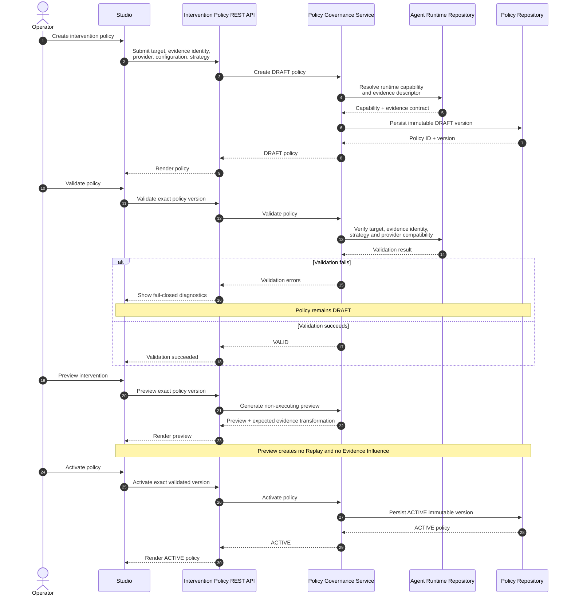
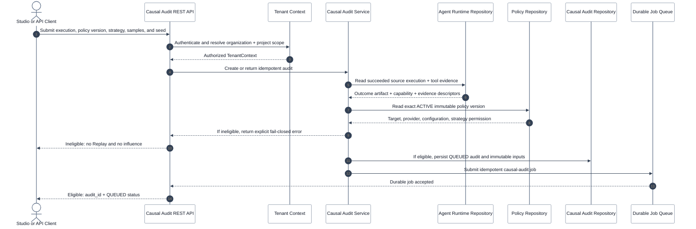
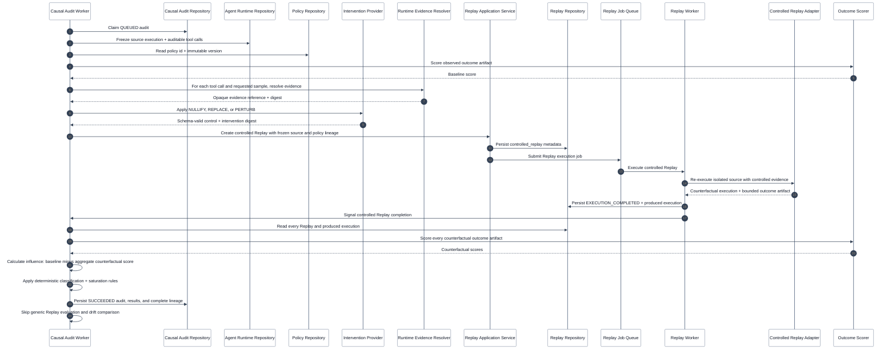
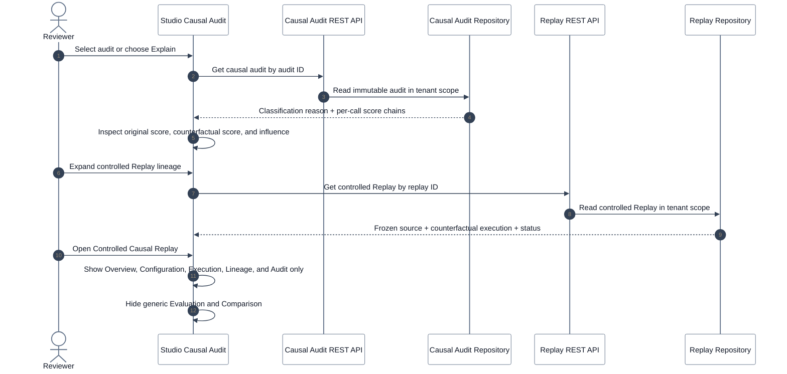
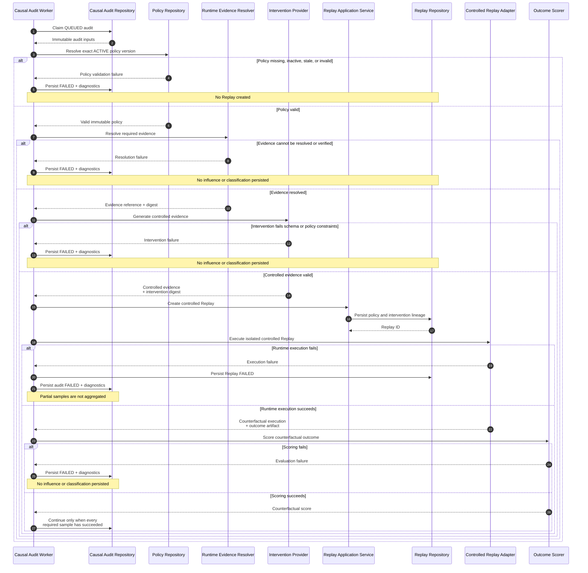

# Causal Audit & Controlled Replay Sequence Diagrams

This companion to [Causal Audit](CAUSAL_AUDIT.md) describes the durable
interactions between Studio, policy governance, Causal Audit, Replay, and a
runtime-owned controlled Replay adapter. It is intentionally split into small
diagrams: policy governance, audit submission, counterfactual execution,
review, and failure handling have different owners and terminal conditions.

## 1. Govern Intervention Policy

An intervention policy authorizes exactly one controlled evidence strategy for
one runtime-declared evidence identity. Validation and preview are safety
operations; neither creates a Replay or Evidence Influence record.



## 2. Submit Causal Audit

The API only accepts an audit when the source execution, selected policy, and
runtime capability prove that a safe controlled Replay can be run. It returns
after queueing durable work; the observed execution is never changed.



## 3. Execute Controlled Evidence & Finalize Audit

This is the causal mechanism. Causal Audit composes Replay; it does not create
another execution engine. The runtime adapter owns evidence resolution and
safe isolated re-execution using the frozen source reference.



## 4. Inspect Result & Follow Lineage

Studio renders persisted state. It does not recalculate Evidence Influence in
the browser. A controlled Replay links back to the exact Causal Audit, where
the policy version, intervention digest, counterfactual execution, and
evaluator score can be inspected together.



## 5. Partial Evidence or Execution Failure

There is no best-effort influence. If policy validation, evidence resolution,
counterfactual generation, isolated execution, or scoring fails for a required
sample, the audit becomes `FAILED` and persists diagnostics without a
classification or influence record.



## Lineage Invariant

Evidence Influence is persisted only when every required value below is
available and tenant-scoped:

```text
active policy id + immutable version
  -> intervention digest
  -> original and counterfactual evidence references + digests
  -> successful controlled Replay id + counterfactual execution id
  -> evaluator score
  -> aggregate Evidence Influence
  -> deterministic classification and explanation
```

An incomplete chain is an audit failure, not a reduced-confidence result.
