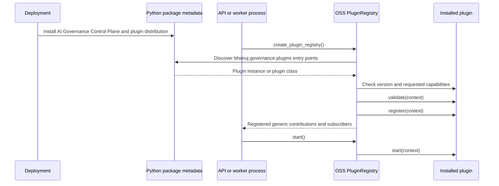
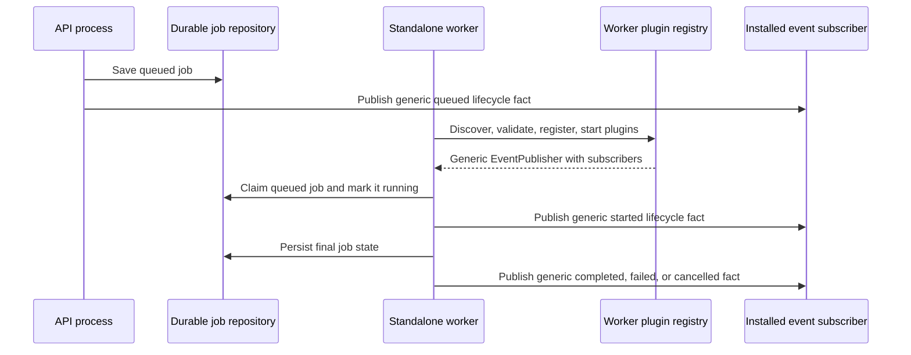
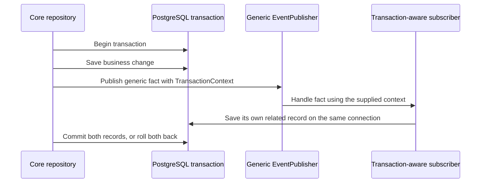

# Plugin Extensions

This guide is for a new AI Governance Control Plane engineer, a plugin author, or a support person
who needs to understand why a feature works in the API but not in a worker.
It describes the generic OSS extension model. It intentionally does not define
any Enterprise product feature, database table, route, or event name.

## Start with the simple idea

A **plugin** is a separately installed Python package that adds capability to
AI Governance Control Plane without changing AI Governance Control Plane source code. It is like a carefully controlled
power socket:

- AI Governance Control Plane owns the socket, the startup order, and the safety checks.
- A plugin owns the feature it plugs in.
- AI Governance Control Plane does not know the plugin's product rules.
- The plugin must not reach into private AI Governance Control Plane objects to make something work.

This keeps the dependency direction safe:

```text
Plugin package  ──uses Plugin API contracts──>  BHANUJ Plugin API
AI Governance Control Plane OSS ──────────────>  BHANUJ Plugin API
AI Governance Control Plane OSS      ──never imports──────────>  a plugin package
```

If a plugin is removed, AI Governance Control Plane still starts without that plugin's feature.
If a plugin is installed but invalid, startup fails clearly rather than
starting a half-configured process.

## The people and pieces involved

| Name | Description | Owns what? |
| --- | --- | --- |
| Host process | A running API server or background worker. | Starts and stops plugins. |
| Plugin registry | The OSS component that discovers and manages plugins. | Validation, ordering, diagnostics, lifecycle. |
| Plugin | A separately packaged feature. | Its routes, subscriptions, providers, and feature behavior. |
| Plugin context | The public object handed to a plugin during registration. | The only supported way to add something to AI Governance Control Plane. |
| Event publisher | A generic, in-process notice board. | Lets code in one process notify its installed subscribers. |
| Worker | A background process that claims and runs durable jobs. | Transitions a job after it has been queued. |

## How a plugin becomes available?

The plugin package declares a `bhanuj.governance.plugins` Python entry point. When a
AI Governance Control Plane process starts, the registry asks Python which installed packages
declared an entry point in that group. It does not scan source folders and it
does not import a product edition by name.



The API and the standalone replay worker use this same bootstrap. That detail
matters whenever a plugin listens to facts created by a worker.

The older `ai_governance.plugins` group is read temporarily for compatibility,
but it feeds this same registry. New packages must use the canonical group.

## What a plugin is allowed to do?

During `register(context)`, a plugin receives only supported public contexts.

| Public context | Use it when the plugin needs to… | Do not use it to… |
| --- | --- | --- |
| `context.routes` | Add a versioned API route. | Modify an existing route without explicit OSS replacement authority. |
| `context.events` | Subscribe to immutable, generic domain facts. | Assume the event automatically crosses process boundaries. |
| `context.providers` | Add, replace with permission, or decorate a public SPI provider. | Reach into a concrete Core implementation. |
| `context.hooks` | Run declared work at an ordered extension hook. | Hide business work in an unrelated hook. |
| `context.contributions` | Add a generic setting, permission, middleware, job handler, health, metrics, or telemetry contribution. | Invent a new contribution type locally. |

`validate()` checks configuration. `register()` declares what the plugin adds.
`start()` begins runtime activity only after every plugin registered correctly.
`stop()` releases resources during shutdown. Keeping those jobs separate makes
startup failures predictable and supportable.

## Why the worker must also load plugins?

An `EventPublisher` is intentionally **in process**. It is not Kafka, it is
not a database queue, and it does not send messages to another container. It
calls the subscribers registered in the process that publishes the event.

A job commonly changes state in two processes:

1. The API accepts work and queues a durable job.
2. A worker claims that job and later starts, succeeds, fails, or cancels it.

Without plugin bootstrap in the worker, a plugin can observe the first fact in
the API but cannot observe the later facts in the worker. The shared runtime
bootstrap prevents that split-brain behavior.



The worker must have the same plugin distribution, compatible configuration,
and access to the same durable job database as the API. Otherwise it can still
run a job, but a plugin installed only in the API cannot observe worker-local
facts.

## Transaction Boundary

Sometimes a plugin needs a business change and another persisted fact to
succeed or fail together. AI Governance Control Plane provides a generic `TransactionContext` for
the narrow case where the Core repository already owns an open transaction.



Core still owns the transaction. A plugin may use the provided context but must
never create, commit, or roll back the Core transaction. This generic contract
is useful for more than one plugin and deliberately contains no product name.

## What OSS does not promise?

Do not mistake the plugin event publisher for a durable integration platform.
OSS does **not** promise that a generic in-process event is:

- stored forever;
- delivered to another process or machine;
- retried after an external failure;
- ordered globally; or
- suitable for sending credentials or tenant-sensitive payloads.

An extension that needs durable external delivery must own those rules—such as
its own persisted records, retry policy, leases, and dead-letter handling—on
top of the generic contract. That keeps OSS reusable and keeps feature-specific
semantics out of Core.

## Support Checklist

When a plugin feature appears to be missing, work through this order:

1. Confirm the plugin distribution is installed in the failing process, not
   only in the API image.
2. Confirm the plugin's AI Governance Control Plane version range matches the installed AI Governance Control Plane
   version.
3. Read startup logs for plugin validation or registration errors.
4. Check the runtime extension diagnostics endpoint when the API is available.
5. Confirm both API and worker use the same relevant configuration and durable
   repository.
6. Check whether the expected fact happens in the API or the worker. A worker
   fact requires the worker to bootstrap the plugin.
7. If the plugin needs persistence, determine whether it is using an ordinary
   standalone write or an approved shared transaction context.

Never work around an issue by importing a plugin from Core or by adding the
plugin's feature name to a Core enum, route, setting, or persistence schema.
That turns an extension into a hidden fork and makes future upgrades unsafe.

## Adding a new plugin capability

Before writing code, answer these questions in the design:

1. Can the plugin use an existing public context? Prefer that path.
2. Is a requested Core contract generic enough for at least two independent
   consumers? If not, keep the behavior in the plugin.
3. Does the feature have a tenant boundary, a credential boundary, or a durable
   delivery requirement? Document each explicitly.
4. Which process produces each fact, and which process must consume it?
5. What should support staff inspect when configuration, startup, delivery, or
   a worker transition fails?

Read [Plugin Extension Contracts](../plugin-extension-contracts.md) for the
reference contract list and [Plugin Runtime Processes](PLUGIN_RUNTIME_PROCESSES.md)
for a shorter process-focused summary.
